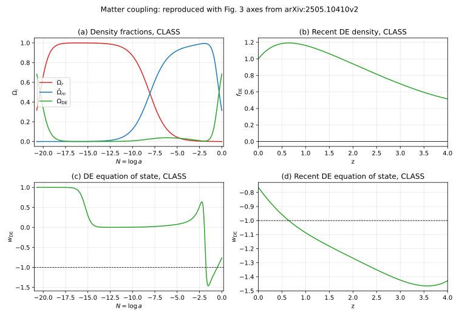
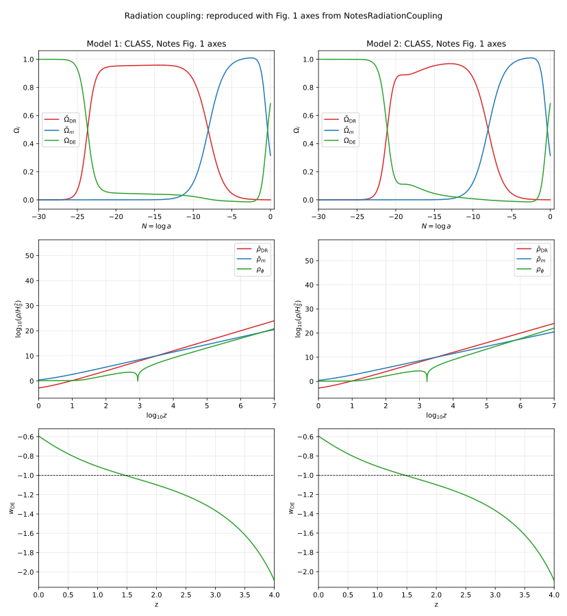

# Scalar-Field Matter and Radiation Couplings in CLASS

This note summarizes the CLASS changes on branch `DE_DR_DM_int` for the scalar-field couplings to matter and dark radiation. The reference equations are `REFS_FOR_CLAUDE/2505.10410v2.pdf` for the matter-coupled example and `REFS_FOR_CLAUDE/NotesRadiationCoupling_DONTTOUCH.pdf` / `NotesRadiationCoupling260616.tex` for the radiation-coupled example.

## Scope of the Implementation

The implementation is entirely inside CLASS. External scripts were only used to inspect output tables and generate the comparison SVGs in `doc/figures/`.

The relevant commits are:

- `11432659 Implement matter-coupled scalar background`
- `2f4abc0d Implement radiation-coupled scalar background`
- `dfb1975c Add scalar dark radiation perturbations`

The main files touched are:

- `include/background.h`
- `source/input.c`
- `source/background.c`
- `source/perturbations.c`
- `fig3_2505_matter.ini`
- `notes_fig1_model1.ini`
- `notes_fig1_model2.ini`
- `explanatory.ini`

## Matter Coupling

For the matter sector, the implementation adds the `matter_exp` conformal form

```text
A_m(phi) = 1 + scf_C0 (1 - exp(-scf_beta phi)),
C(phi) = A_m(phi)^2.
```

The existing qcdm/scf conformal coupling machinery is reused through `C_scf`, `dC_scf`, `ddC_scf`, `Q_scf`, and the existing perturbation coefficients. The `fig3_2505_matter.ini` file uses the Eq. (3.8) setup of `2505.10410v2.pdf`, with `scf_lambda = sqrt(2)`, not `2`.

The background reconstruction option

```text
scf_ic_from_today = yes
```

shoots backward from today and reconstructs `scf_V0`, `phi_ini`, `phi_prime_ini`, and the initial qcdm density from the requested today values. This is used for the Fig. 3 reproduction.

The effective dark-energy density and equation of state are output as

```text
rho_DE_eff = rho_phi + (A_m - 1) rho_bar_m
w_DE_eff rho_DE_eff = p_phi
```

for the matter-only case.



At `z=0`, the CLASS run gives:

| quantity | CLASS value |
|---|---:|
| `w_phi0` | `-0.763660007` |
| `w_DE0` | `-0.763660007` |
| `Omega_r0` | `9.9999997e-5` |
| `Omega_m0` | `0.314900009` |
| `Omega_DE0` | `0.684999991` |
| `phi0` | `-1.31e-8` |

## Radiation Coupling

The radiation sector uses a separate multiplicative coupling to interacting dark radiation:

```text
A_r(phi) = 1 + scf_C0_r (1 - exp(-scf_beta_r phi)),
rho_idr = A_r(phi) rho_bar_idr,
rho_bar_idr proportional to a^-4.
```

The public input switch is

```text
scf_interacting_radiation = yes
```

The parameters `scf_C0_r` and `scf_beta_r` are free. The values in `notes_fig1_model1.ini` and `notes_fig1_model2.ini` reproduce the two examples in the Notes, but the code does not hard-code those choices.

The radiation Lagrangian normalization only fixes the normalization of the underlying radiation amplitude. The implemented stress tensor is the fluid-level tensor used by CLASS:

```text
T^0_0 = -rho_idr,
T^i_j = (rho_idr / 3) delta^i_j,
rho_idr = A_r rho_bar_idr.
```

Thus `A_r` rescales the full dark-radiation tensor, not just a scalar energy-density bookkeeping term. The anisotropic stress hierarchy is otherwise left as the existing idr hierarchy.

The scalar background equation is implemented in CLASS density units as

```text
phi'' + 2 Hc phi' + a^2 (V_phi - Q_m - Q_r) = 0,
Q_r = -3 rho_idr dln(A_r)/dphi.
```

The sign follows from the physical equation

```text
phi_ddot + 3 H phi_dot + V_phi + rho_bar_r A_r,phi = 0,
```

with CLASS storing densities multiplied by `8 pi G / 3`.

The effective dark-energy output is extended to

```text
rho_DE_eff = rho_phi + (A_m - 1) rho_bar_m + (A_r - 1) rho_bar_r,
w_DE_eff rho_DE_eff = p_phi + (A_r - 1) rho_bar_r / 3.
```



At `z=0`, the two Notes models give:

| quantity | model 1 | model 2 |
|---|---:|---:|
| `w_phi0` | `-0.594208876` | `-0.594223632` |
| `w_DE0` | `-0.594208863` | `-0.594223633` |
| `Omega_r0` | `1.0000022e-4` | `9.9999990e-5` |
| `Omega_m0` | `0.314899728` | `0.314900018` |
| `Omega_DE0` | `0.685000288` | `0.684999981` |
| `phi0` | `1.30e-6` | `-5.69e-8` |
| `A_r0` | `0.999999901` | `1.000000001` |

## Radiation Perturbations

The perturbations use the full coupled variables already evolved by CLASS:

```text
delta_idr = delta rho_idr / rho_idr,
theta_idr = full idr velocity divergence.
```

Define

```text
Lambda_r = d ln(A_r) / dphi,
Lambda2_r = d^2 ln(A_r) / dphi^2.
```

The implemented synchronous-gauge idr equations are

```text
delta_idr' =
  -4/3 (theta_idr + h'/2)
  + Lambda_r delta_phi'
  + Lambda2_r phi' delta_phi,

theta_idr' =
  k^2 delta_idr / 4
  - k^2 sigma_idr
  + 3/4 Lambda_r k^2 delta_phi
  - Lambda_r phi' theta_idr.
```

The shear and higher multipoles are left in the standard idr hierarchy. IDM-DR scattering terms are preserved and the SCF force is added on top of the standard idr Euler equation when `scf_interacting_radiation = yes`.

The scalar perturbation equation receives the radiation source

```text
delta_Q_r =
  -3 rho_idr (Lambda_r delta_idr + Lambda2_r delta_phi),
```

which is added as `a^2 delta_Q_r` to the perturbed KG equation, in the same CLASS convention as the qcdm `delta_Q_scf` source. In Newtonian gauge, the corresponding metric perturbation contribution `2 psi Q_r` is included analogously to the existing qcdm term.

## Validation Runs

The following checks were run after implementation:

```text
make class
./class fig3_2505_matter.ini
./class notes_fig1_model1.ini
./class notes_fig1_model2.ini
```

For perturbations, the exact Notes Fig. 1 files are intentionally background-oriented: they set `Omega_g = 1e-12` and use a huge `xi_idr` to make the dark-radiation density dominate the radiation budget while photons are only a trace component. That is useful for reproducing the background plots, but it is not a healthy thermodynamics test.

The perturbation code was therefore smoke-tested with a temporary default-like cosmology containing a small SCF component and small idr component, with `output = mPk`. That run completed the background, thermodynamics, source, primordial, and Fourier modules and wrote a matter power spectrum.

## Current Limitations

The radiation coupling is implemented for the background, idr continuity/Euler perturbations, and the scalar perturbation source. The idr shear and higher hierarchy are not modified beyond the existing CLASS idr hierarchy. This matches the Notes assumption that the new radiation coupling changes the fluid-level density and velocity equations while leaving the anisotropic-stress hierarchy untouched.

The `A_r(phi)` functional form is currently the exponential form above. The interface keeps `scf_C0_r` and `scf_beta_r` free, but adding alternate radiation coupling functions would require extending `A_r_scf`, `dA_r_scf`, and `ddA_r_scf` in `source/background.c`.
